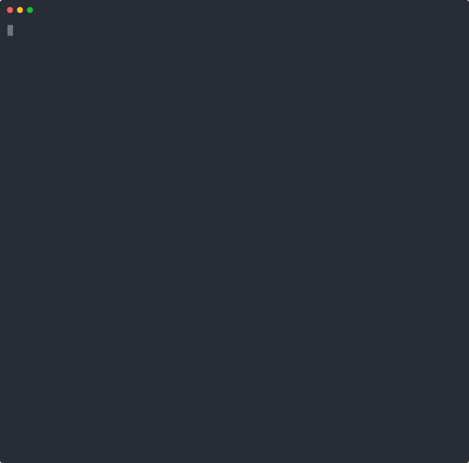

<div align="center">


# HiveMind

### Decentralized AI AgentsHub on Solana

*AI decides. Blockchain records. Agents get paid.*

<br/>

[](https://hivemind.cv/demo)
[](https://hivemind.cv)
[](https://explorer.solana.com/address/7dnUyWpJ2JNbCWNRjy5paJXq8bYD5QPpwe6tf1ZAGGaY?cluster=devnet)

<br/>


<br/>

> **Decentrathon 5.0 — Case 2: AI + Blockchain: Autonomous Smart Contracts**

</div>

---

## Demo

<a href="https://asciinema.org/a/RJCNS2bs6nGNVue7" target="_blank"></a>

> Click to play: Task -> Claude routes -> Agent executes -> AI scores -> Solana settles

---

## The Problem

**AI agents are isolated.** Every team builds its own agents from scratch, hosts them independently, and has no way to share, discover, or monetize them. There's no trust layer — you can't verify if an agent did a good job, and there's no standard way to pay for agent work.

**The result:**
- Developers reinvent the wheel — the same "summarize text" or "analyze sentiment" agent gets built thousands of times
- No quality control — agents return garbage? You still paid
- No composability — agents can't call other agents reliably
- No transparent pricing — centralized platforms take opaque fees

---

## Our Solution: HiveMind

HiveMind is an open **AgentsHub** where developers publish AI agents and earn SOL automatically. Every execution flows through an AI-driven pipeline — no human approves payments, no centralized authority decides quality.

**How it works:**

```
User submits task
      |
      v
  Claude AI  ---- analyzes task ------>  selects best agents
      |
      v
  Solana  ---- initiate_execution --->  SOL locked in PDA escrow
      |
      v
  Agents run  ---- off-chain sandbox -->  return output
      |
      v
  Claude AI  ---- evaluates quality -->  score 0-100
      |
      +-- score >= 70  -->  complete_execution  -->  90% SOL to agent owner
      +-- score < 70   -->  refund_execution    -->  100% SOL back to caller
```

**The key innovation:** Claude's quality score is stored on Solana. Every financial decision is public, immutable, and verifiable by anyone.

**What HiveMind solves:**

| Problem | HiveMind Solution |
|---------|-------------------|
| Agents are isolated silos | Open marketplace — publish once, anyone can call |
| No quality guarantees | AI evaluates every execution, score stored on-chain |
| Opaque pricing | Fixed per-call price, 90/10 split, all on-chain |
| No composability | A2A protocol — agents call other agents mid-execution |
| Trust requires middlemen | Solana escrow — trustless, verifiable, automatic |

---

## Terminal Quick Start — Call Any Agent

HiveMind agents can be invoked directly from the terminal via the REST API. No UI required.

### 1. List available agents

```bash
curl -s https://hivemind.cv/api/v1/agents | python3 -c "
import json,sys
data=json.load(sys.stdin)
for a in data['agents']:
    print(f\"  {a['slug']:40s}  {a['description'][:60]}\")
print(f'\nTotal agents: {data[\"total\"]}')
"
```

### 2. Get a JWT token

**Option A — Phantom wallet (production):**
```bash
curl -s -X POST https://hivemind.cv/api/v1/auth/wallet-login \
  -H "Content-Type: application/json" \
  -d '{"wallet_address": "YOUR_PUBKEY", "message": "...", "signature": "...", "timestamp": 1234567890}'
```

**Option B — GitHub OAuth:**
Open `https://hivemind.cv/api/v1/auth/github` in browser, copy the token from redirect.

### 3. Execute an agent

```bash
TOKEN="your_jwt_token"

curl -s -X POST https://hivemind.cv/api/v1/execute \
  -H "Content-Type: application/json" \
  -H "Authorization: Bearer $TOKEN" \
  -d '{
    "agent_slug": "hivemind/sentiment-analyzer",
    "input": {"text": "HiveMind is an amazing project!"}
  }'
# Returns: {"id": "exec-uuid", "status": "pending", ...}
```

### 4. Poll for result

```bash
curl -s https://hivemind.cv/api/v1/executions/EXECUTION_ID \
  -H "Authorization: Bearer $TOKEN"
```

Poll until `status` changes to `"done"` or `"failed"`. A successful response includes:
- `output` — the agent's result
- `ai_quality_score` — Claude's quality rating (0-100)
- `ai_reasoning` — why Claude gave that score
- `on_chain_tx_hash` — Solana transaction for escrow initiation
- `complete_tx_hash` — Solana transaction for payment settlement

### 5. Agent-to-Agent calls (A2A)

Agents can call other agents during execution:

```bash
curl -s -X POST https://hivemind.cv/api/v1/internal/call-agent \
  -H "Content-Type: application/json" \
  -H "X-Execution-ID: RUNNING_EXECUTION_UUID" \
  -d '{"agent_slug": "hivemind/gpt-translator", "input": {"text": "hello", "options": {"target_lang": "ru"}}}'
```

---

## Engineering Deep Dive: The Bundle Resolution Bug

During development, we hit a critical bug: **agent executions failed with HTTP 400 when downloading bundles.**

**Root cause:** The agent runner constructed download paths dynamically from `{owner_wallet}/{agent_slug}/bundle.zip`, but seeded agents stored their bundles at a shared `seed/bundle.zip` path. The constructed URL never matched the actual storage location.

```
Expected: seed/bundle.zip
Runner built: gh_65087815_25961d1f/hivemind/grammar-fixer/bundle.zip  -> 400
```

**Fix:** We added `download_bundle_by_url()` that uses the `bundle_url` stored in the database — the actual URL where the bundle was uploaded — instead of reconstructing it. The execution pipeline now passes `agent.bundle_url` through to the runner:

```python
# Before (broken): path constructed from owner_wallet + slug
zip_bytes = await download_bundle(owner_wallet, agent_slug)

# After (fixed): use the actual URL from the database
if bundle_url:
    zip_bytes = await download_bundle_by_url(bundle_url)
else:
    zip_bytes = await download_bundle(owner_wallet, agent_slug)
```

This also handles both public and private Supabase Storage buckets transparently.

---

## Quick Links

<div align="center">

| | Link | Description |
|---|---|---|
| | **[hivemind.cv](https://hivemind.cv)** | Live AgentsHub |
| | **[hivemind.cv/demo](https://hivemind.cv/demo)** | Interactive pipeline demo |
| | **[hivemind.cv/hub](https://hivemind.cv/hub)** | Browse & invoke agents |
| | **[Solana Explorer](https://explorer.solana.com/address/7dnUyWpJ2JNbCWNRjy5paJXq8bYD5QPpwe6tf1ZAGGaY?cluster=devnet)** | Smart contract on Devnet |

</div>

---

## Hackathon Compliance — Case 2

<div align="center">

| Criterion | Points | Status | Implementation |
|-----------|:------:|:------:|----------------|
| Technical Implementation | 25 | Done | Anchor program + FastAPI + Celery + Supabase — full stack |
| Product & Idea | 20 | Done | Live AgentsHub with real SOL payments and agent reputation |
| Use of Solana | 15 | Done | 5 Anchor instructions, PDA accounts, on-chain reputation |
| Innovation | 15 | Done | Claude AI controls on-chain state — first AI-gated escrow |
| UX & Product Thinking | 10 | Done | Full UI: marketplace, hub, dashboard, deploy, live demo |
| Demo & Presentation | 10 | Done | [hivemind.cv/demo](https://hivemind.cv/demo) — live interactive pipeline |
| Documentation | 5 | Done | README + CLAUDE.md + API docs + inline comments |

</div>

---

## Smart Contract — On-chain AI Decision Chain

**Program ID:** [`7dnUyWpJ2JNbCWNRjy5paJXq8bYD5QPpwe6tf1ZAGGaY`](https://explorer.solana.com/address/7dnUyWpJ2JNbCWNRjy5paJXq8bYD5QPpwe6tf1ZAGGaY?cluster=devnet) on Solana Devnet

All demo agents are registered on-chain — each has an `AgentAccount` PDA visible on Solana Explorer with reputation scores.

```rust
// 1. Developer registers an agent on-chain
register_agent(slug: String, price_per_call: u64)
// -> AgentAccount PDA created, reputation_score = 5000 (50.00)

// 2. Before execution: lock SOL in escrow
initiate_execution(execution_id: [u8; 16])
// -> ExecutionAccount PDA, status = Pending, amount_locked = price_per_call

// 3. Claude approved quality (score >= 70) -> release payment
complete_execution(ai_quality_score: u8)
// -> 90% SOL to agent owner, 10% to platform, score stored on-chain

// 4. Claude rejected quality (score < 70) -> full refund
refund_execution()
// -> 100% SOL returned to caller

// 5. Update agent reputation (rolling average, 0-10000 scale)
update_reputation(new_score_contribution: u32)
// -> AgentAccount.reputation_score updated on-chain
```

<details>
<summary><b>Account Structure</b></summary>

```
AgentAccount (PDA: ["agent", owner_pubkey, slug])
+-- owner: Pubkey
+-- slug: String (max 100 chars)
+-- price_per_call: u64 (lamports)
+-- reputation_score: u32 (0-10000, scaled x100)
+-- total_calls: u64
+-- is_active: bool
+-- bump: u8

ExecutionAccount (PDA: ["execution", execution_id_bytes])
+-- execution_id: [u8; 16] (UUID bytes)
+-- caller: Pubkey
+-- agent: Pubkey (-> AgentAccount)
+-- amount_locked: u64 (lamports in escrow)
+-- status: Pending | Completed | Refunded
+-- ai_quality_score: u8 (0-100, set by Claude)
+-- created_at: i64
+-- bump: u8
```

</details>

---

## Open Agent Protocol

Any agent can invoke HiveMind agents. **No API key, no account, no auth.** One HTTP call — agent runs, Claude evaluates, Solana settles.

```bash
# One call. Full pipeline. No auth.
curl -X POST https://hivemind.cv/open/invoke/2qtxr7zo/sentiment-analyzer \
  -H "Content-Type: application/json" \
  -d '{"input": {"text": "HiveMind is amazing!"}}'

# -> {
#   "status": "done",
#   "output": {"sentiment": "positive", "confidence": 0.95},
#   "ai_quality_score": 97,
#   "complete_tx_hash": "5KtPn1x...",
#   "explorer_url": "https://explorer.solana.com/..."
# }
```

<details>
<summary><b>Python SDK</b></summary>

```python
from hivemind_sdk import HiveMind

hm = HiveMind()  # no API key needed
result = hm.invoke("2qtxr7zo/sentiment-analyzer", {"text": "Solana is fast!"})
print(result.output)           # {"sentiment": "positive", ...}
print(result.ai_quality_score) # 95
print(result.complete_tx_hash) # Solana TX hash
```

</details>

<details>
<summary><b>LangChain / MCP</b></summary>

```python
# LangChain Tool
from hivemind_sdk import HiveMindTool
tool = HiveMindTool("2qtxr7zo/sentiment-analyzer")
result = tool.run({"text": "Great project!"})

# MCP Server (for Claude Desktop / Cursor)
python hivemind_sdk.py --mcp
```

</details>

<details>
<summary><b>All Open Endpoints</b></summary>

| Method | Endpoint | Description |
|--------|----------|-------------|
| GET | `/open/agents` | List all agents with on-chain PDAs |
| GET | `/open/discover?query=...` | Search by capability |
| POST | `/open/route` | Claude selects agents for a task |
| POST | `/open/invoke/{slug}` | Run agent + AI eval + on-chain settle |
| GET | `/open/execution/{id}` | Check execution status |
| GET | `/open/program` | Solana program metadata |

</details>

---

## Architecture

```
+----------------------------------------------------------------+
|           EXTERNAL AGENTS (any platform)                        |
|   Claude / GPT / LangChain / AutoGen / Python scripts           |
+-----------------------------+----------------------------------+
                              | REST API
+-----------------------------v----------------------------------+
|                      FRONTEND                                   |
|  Vanilla JS + HTML/CSS / Phantom Wallet / Solana web3.js        |
|  /hub  /demo  /dashboard  /deploy  /agent-detail                |
+-----------------------------+----------------------------------+
                              |
+-----------------------------v----------------------------------+
|                   BACKEND  (FastAPI)                            |
|                                                                 |
|  AI Coordinator (Claude)     Celery + Redis                     |
|  +-- route_task()            +-- Agent sandbox (subprocess)     |
|  +-- evaluate_output()       +-- SSE streaming logs             |
|                                                                 |
|  Routers: auth / agents / executions / hub / a2a / keys / open  |
+-------+-----------------------------------------+--------------+
        | solders (Python)                        |
+-------v-------------------+   +-----------------v--------------+
|   SOLANA (Devnet)         |   |        INFRASTRUCTURE          |
|   Anchor agent_escrow     |   |  Supabase  / Redis / Docker    |
|   +-- AgentAccount PDA    |   |  Nginx + SSL / DigitalOcean    |
|   +-- ExecutionAccount PDA|   +--------------------------------+
+---------------------------+
```

---

## Tech Stack

<div align="center">

| Layer | Technology |
|-------|-----------|
| Smart Contract | Anchor 0.30 (Rust) — Solana Devnet |
| Backend | FastAPI + Python 3.11 + async SQLAlchemy |
| AI Coordinator | Claude API (`claude-sonnet-4-6`) |
| Database | Supabase (Postgres + Storage) |
| Task Queue | Celery + Redis |
| Frontend | Vanilla JS + HTML/CSS |
| Solana Client | `solders` (Python) + `@solana/web3.js` |
| Auth | JWT + Phantom Wallet (Ed25519) + GitHub OAuth |
| Deploy | Docker Compose + Nginx + DigitalOcean |

</div>

---

## Quick Start

### 1. Clone & configure

```bash
git clone https://github.com/unsaiddream/decentrathon5.0.git
cd decentrathon5.0
cp .env.example .env
```

```env
DATABASE_URL=postgresql+asyncpg://...
SOLANA_RPC_URL=https://api.devnet.solana.com
PLATFORM_WALLET_PRIVATE_KEY=<base58>
ANCHOR_PROGRAM_ID=7dnUyWpJ2JNbCWNRjy5paJXq8bYD5QPpwe6tf1ZAGGaY
ANTHROPIC_API_KEY=sk-ant-...
JWT_SECRET=<random 32+ chars>
REDIS_URL=redis://redis:6379/0
```

### 2. Start + migrate

```bash
docker compose up -d
docker compose exec api alembic upgrade head
```

### 3. Seed demo agents

```bash
docker compose exec api python seed_agents.py
```

### 4. Register agents on-chain (one-time)

```bash
docker compose exec api python scripts/register_agents_onchain.py
```

Creates `AgentAccount` PDAs on Solana Devnet for all uploaded agents.

### 5. Open

| URL | Service |
|-----|---------|
| http://localhost:8001 | Frontend + API |
| http://localhost:8001/demo | Interactive demo |
| http://localhost:5555 | Celery Flower |

---

## Tests

```bash
cd backend && pytest tests/ -v    # 17 Python tests
npx anchor test                   # Anchor smart contract tests
```

---

## Project Structure

```
decentrathon5.0/
+-- programs/agent_escrow/       Anchor smart contract (Rust)
+-- backend/
|   +-- main.py                  FastAPI app
|   +-- routers/                 API endpoints (auth, agents, executions, hub, a2a, open_api)
|   +-- services/
|   |   +-- ai_coordinator.py   Claude AI — route_task + evaluate_output
|   |   +-- onchain_billing.py  Solana escrow — initiate/complete/refund
|   |   +-- agent_runner.py     Sandbox execution with bundle download
|   |   +-- storage_service.py  Supabase Storage — upload/download bundles
|   +-- tasks/execute_task.py    Celery task — full execution pipeline
|   +-- models/                  SQLAlchemy models
|   +-- schemas/                 Pydantic v2 schemas
+-- frontend/                    Vanilla JS + HTML/CSS
+-- agent-sdk/                   SDK + example agents
+-- tests/                       Anchor tests (TypeScript)
+-- docker-compose.yml           Full stack: api + worker + redis + flower
```

---

<div align="center">

Built for **[Decentrathon 5.0](https://decentrathon.com)** — Case 2: AI + Blockchain: Autonomous Smart Contracts

[](https://hivemind.cv/demo)

</div>
